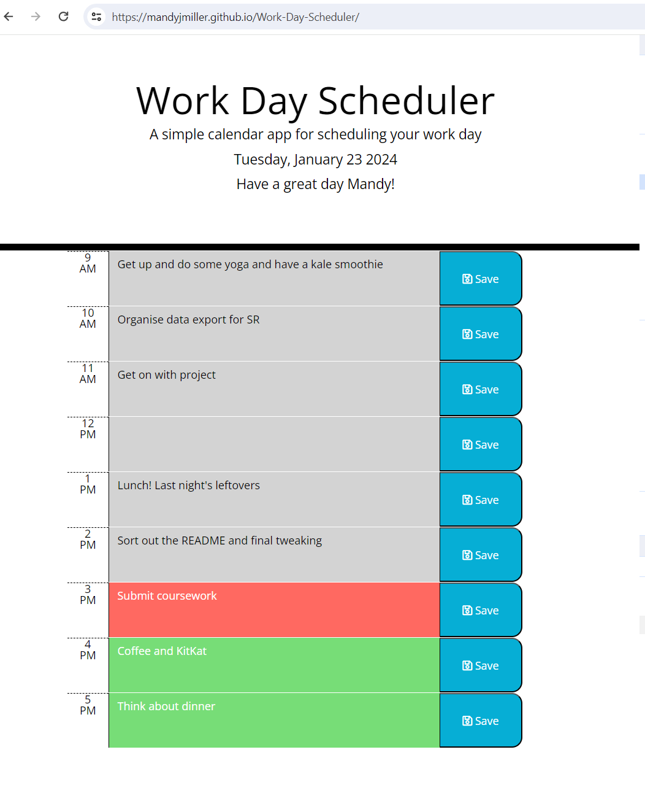

# Work-Day-Scheduler
A simple calendar application that allows a user to save events for each hour of the day

## User Story

AS AN employee with a busy schedule
I WANT to add important events to a daily planner
SO THAT I can manage my time effectively

## Acceptance Criteria

I will have met the brief when the following acceptance criteria are met:

The app should:

* Display the current day at the top of the calender when a user opens the planner.
* Present timeblocks for standard business hours when the user scrolls down.
* Color-code each timeblock based on past, present, and future when the timeblock is viewed.
* Allow a user to enter an event when they click a timeblock
* Save the event in local storage when the save button is clicked in that timeblock.
* Store events between refreshes of a page
* Additionally, it is responsive, mobile first design as we all depend on our phones for our daily agendas

## Installation

No particular installation requirements. Web page can be viewed using Chrome, Firefox, Safari or most other standard browser, using "Inspect" Console to see the output 
The "Application" tab in Inspect can be used to see the scores which have been saved to LocalStorage.

## Usage 

This site can be accessed on GitPages [HERE](https://mandyjmiller.github.io/Work-Day-Scheduler/)

Screenshot of the site can be seen here:

## Credits

Shout out to the teaching team at EdX and fellow students for help and collaboration.

This week's challenge was difficult, so there was a lot of Googling going on.

Particular credit to the following sites for help and guidance :

https://day.js.org/docs/en/display/format

https://freefrontend.com/jquery-calendar-plugins/

[StackOverflow](https://stackoverflow.com/questions/43316726/build-a-calendar-using-javascript-jquery) 

Other Tutorials and base materials from  [Module 7 Challenge](https://bootcampspot.instructure.com/courses/5651/assignments/67071)

## License

MIT License

Copyright (c) 2023 Mandy Miller

Permission is hereby granted, free of charge, to any person obtaining a copy
of this software and associated documentation files (the "Software"), to deal
in the Software without restriction, including without limitation the rights
to use, copy, modify, merge, publish, distribute, sublicense, and/or sell
copies of the Software, and to permit persons to whom the Software is
furnished to do so, subject to the following conditions:

The above copyright notice and this permission notice shall be included in all
copies or substantial portions of the Software.

THE SOFTWARE IS PROVIDED "AS IS", WITHOUT WARRANTY OF ANY KIND, EXPRESS OR
IMPLIED, INCLUDING BUT NOT LIMITED TO THE WARRANTIES OF MERCHANTABILITY,
FITNESS FOR A PARTICULAR PURPOSE AND NONINFRINGEMENT. IN NO EVENT SHALL THE
AUTHORS OR COPYRIGHT HOLDERS BE LIABLE FOR ANY CLAIM, DAMAGES OR OTHER
LIABILITY, WHETHER IN AN ACTION OF CONTRACT, TORT OR OTHERWISE, ARISING FROM,
OUT OF OR IN CONNECTION WITH THE SOFTWARE OR THE USE OR OTHER DEALINGS IN THE
SOFTWARE.

---

© 2023 edX Boot Camps LLC. Confidential and Proprietary. All Rights Reserved.